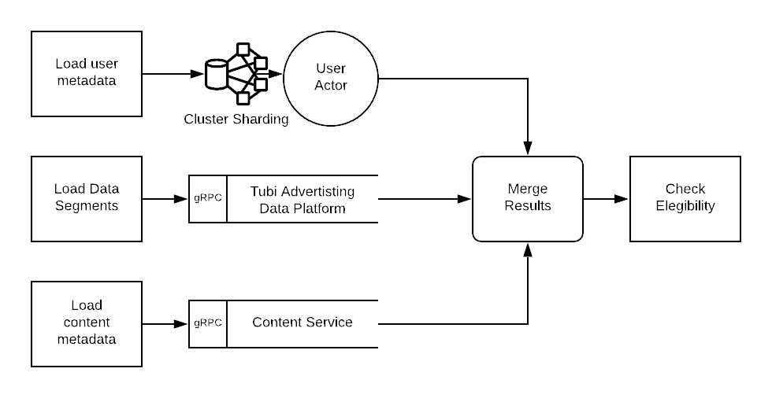
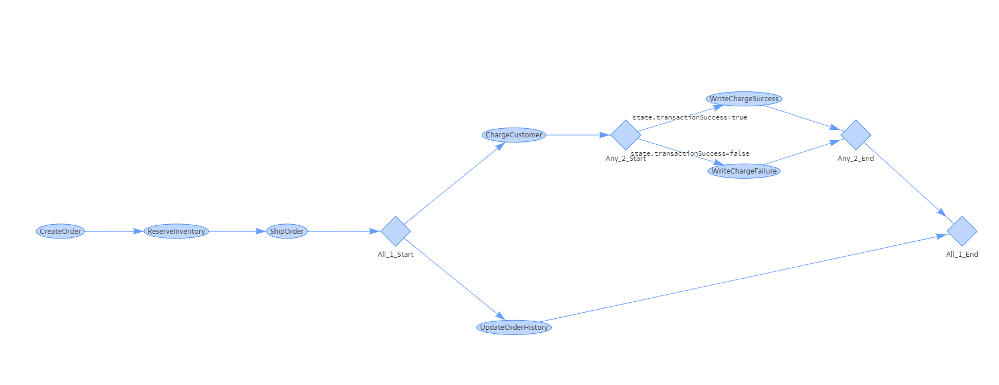
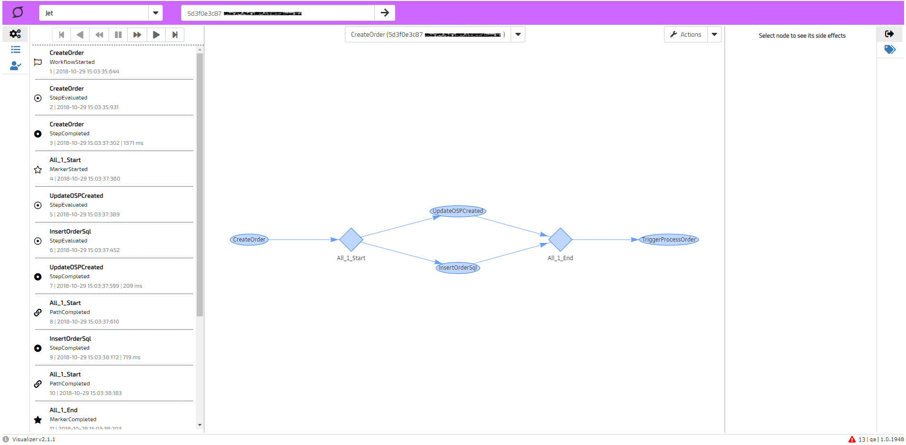

# Whay and What

随着分布式应用的普及，Akka Streams 成为 Akka 生态里面很受欢迎的开源库。作为一个程序员，做任何一个决定之前都会问三个问题：为什么（why）？ 是什么 （what）？怎么做 （how）？作为 Akka Streams 系列文章的第一篇，本文尝试从应用层面回答 Akka Streams 的 why 和 how 的问题，并在最后给出一个具体例子，眼见为实。

## 为什么需要 Akka Streams

所有的技术都是业务驱动的，当现有的技术不能满足业务发展要求时，会出现新一代的技术。Akka Streams 是由于分布式业务系统的普及以及现有技术不能满足分布式软件开发的产物。

### 业务系统的需求

一项优秀的技术其好处应该显而易见。如果简单的回答为什么需要 Akka Streams，答案也非常简单：Akka Streams 提供的流处理（stream processing）方式是业务应用系统的一个非常合适的抽象模型：既涵盖了业务相关的数据和处理逻辑，又可以在不同的层次抽象组合。既适合描述细粒度的本地处理逻辑，又提供了灵活简单的组合能力来描述端到端的分布式业务流程。

多数业务应用系统都很可以很自然的用流程图 [Flowchart](https://en.wikipedia.org/wiki/Flowchart) 或数据流程图 [Data-flow Diagram DFD](https://en.wikipedia.org/wiki/Data-flow_diagram) 来表达， 而 Akka Streams 就是这类流程图的软件实现。软件是现实世界的一个模型，越能描述真实世界的特性的软件模型，就越容易正确的理解和实现。下图来自[C4 软件架构模型](https://c4model.com/)


可以看到软件架构的本质是不同层次的模块及其交互。C4 模型只是一种纸上的软件架构，流处理是其具体实现。下面是二个基于不同技术栈的真实流处理例子。

- [Tubi 的视频广告处理流程片段](https://code.tubitv.com/a-fully-reactive-ad-serving-platform-using-scala-akka-streams-13299e7ea04e)：基于 Akka Streams 的流处理



- [Jet.com 的订单处理流程](https://medium.com/jettech/microservices-to-workflows-expressing-business-flows-using-an-f-dsl-d2e74e6d6d5e)：采用 F# 自己开发的流处理



上述例子是简化了的架构模型，只描述了业务流程的核心处理步骤，其中隐含了很多真实业务系统的处理需求：

- 业务流程是分布式的，各个业务模块可以运行在不同的系统甚至来自企业外部。
- 各个处理步骤都是实时响应式的，一旦数据到达或相关事件发生，都会立刻触发下一步的处理。
- 为保证资源利用率，各个处理步骤都是异步独立运行。
- 各个步骤之间有流量控制协议来解决上游和下游的处理速度不匹配问题。
- 需要具备业务异常和系统失效处理机制。
- 业务流程可以有任意的处理拓扑结构。
- 支持基于分形 [Fractal](https://en.wikipedia.org/wiki/Fractal) 的组合：每个小模块可以简单灵活的组成大模块。组合后的大模块仍保持相同的特质。换言之，各个处理步骤分拆或组合后仍保持相同的运行与组合特质。分形组合的意义在于，一旦了解了各个小模块的功能以及组合的规则，那么大模块的功能就可以很好的理解而无需额外的信息。如果软件的模块及其组合具有分形的特质，那么软件开发的效率与可维护性会有很大的提升。

以上每一条要求实现起来都有很大的工作量而且需要时间来成熟，不是每个开发团队都有相应的技能和时间来打造一个满足上述所有要求的新轮子。当使用的软件开发工具功能和真实业务特质需求高度吻合上，软件系统的设计、实现、测试和维护都会变得容易而且高效。流处理模型的最大特点就在于把上面这些特质需求包含在模型里面。相对而言，当前流行的微服务是一种服务拆分的理念和粗旷的点对点交互模型，缺乏对端到端的多段处理流程支持和不同层次的抽象手段。而反应式流处理模型就是为了提供高性能的分布式端到端流程处理能力，并且追求不同层次的抽象组合能力，这二个特点非常适合作为企业应用架构模型。[Jet.com](https://jet.com/) 是沃尔玛并购的一家以技术闻名的电子商务公司。是比较早认识到流处理的价值并把架构重心从微服务转移到工作流（workflow）处理模型。其自己研发的流处理框架加上图形式定义操作管理界面，使得业务开发变得透明、灵活、而且高效。下图来自其博客[从微服务到工作流](https://medium.com/jettech/microservices-to-workflows-the-evolution-of-jets-order-management-system-9e5669bd53ab)。可以看到他们做到了以简单的拖拉方式定义和改变工作流，实现这种软件能力相信是很多研发团队的梦想。



幸运的是 Akka Streams 是一套比较成熟的开源流处理库，对上面的每个业务需求都有比较好的支持，因而对基于反应式流处理模型的业务软件开发提供了强大的帮助。

### 技术趋势

开发 Akka Streams 的目的是为了达成[反应式宣言](https://www.reactivemanifesto.org/zh-CN)中列出的及时响应、耐挫性、可伸缩性、以及消息驱动的目标. 作为反应式编程的倡导者和先驱，[Erik Meijer](<https://en.wikipedia.org/wiki/Erik_Meijer_(computer_scientist)>)发现了 `Enumerable` 模式和 `Observable` 模式作为数据生产者和消费者的二元性，参见 [setter and getter duality](https://channel9.msdn.com/Events/Lang-NEXT/Lang-NEXT-2014/Keynote-Duality)，并把二者统一到一套包含流量控制的异步编程 API，即后来的反应式流（reactive streams）编程 [ReactiveX](http://reactivex.io/) API。 其不同语言实现比如 Rx.NET, RxJava 以及 RxJs 在前后端开发都得到广泛的应用。

看到反应式流编程的普及和优点，Java 9 将其理念纳入标准 API。可是 Java 9 的流编程 API 只提供了几个底层 API，适合不多的简单应用场景。RxJava 则提供了比较丰富的反应式 API，但是对于流编程的支持仅限于进程内的 API 接口，是事件驱动（event-driven）而非消息驱动，且很长时间都不支持回压 back pressure 这种基本需求。复杂的拓扑结构以及灵活的模块组合方式则是踪影皆无。分布式，流量控制，灵活的拓扑与分形组合是成熟可用的流处理框架的紧迫要求。Akka Streams 的开发符合了这种技术发展的趋势。从技术角度看，反应式流处理编程的发展过程包括了下面多个维度的扩展：

- 从单一的数据处理进展到包含多个甚至无限数量的数据流, 数据流中的数据先后次序及产生速度都隐含了时间的概念。
- 从同步处理发展到异步处理。
- 从单线程单进程处理到分布式处理。
- 从线性结构到任意拓扑结构。
- 从单一处理流程到不同抽象层次的分形组合处理流程。

自 2014 年 4 月[发布预览版](https://www.lightbend.com/blog/typesafe-announces-akka-streams) 至今，Akka Streams 逐渐发展为成熟且有丰富功能的反应式流编程库。今天看到的 Akka Streams 的功能特点是其开发团队多年开发高性能、高可用的分布式系统经验的结果。

## Akka Streams 是什么

明白了为什么会有 Akka Streams， 也就比较好理解 Akka Streams 是什么了。简单说，Akka Streams is an open source library that provides asychronous stream processing with non-blocking back pressure。就是一个流处理开源库，提供了异步流处理以及非阻塞的回压功能。其主要特点如下：

- 面向应用开发者的的高级流处理 API
- 丰富的流量控制功能
- 原生异步处理能力
- 跨进程分布式处理
- 丰富的数据流处理机制
- 提供显式的错误处理机制
- 支持包含多入口/多出口以及闭环在内的任意处理拓扑结构
- 多个小的处理模块可以灵活组合为大的处理模块，这些组合后的模块可以仍像最初的原子模块那样在不同层次任意组合。

从更抽象的层次讲，所有的程序都可以看成包含二个核心概念的系统：数据结构和函数。Akka streams 的数据结构是基于回压的数据流组合成的各种图，其函数则是对图中数据流的操作。

### 面向开发者的流处理 API

基于 JVM 的 [Rective Streams API](https://www.reactive-streams.org/) 是一个仅有 4 个接口和一个类的定义。这是一个支持回压的异步流处理最小接口集合，是 [Service Provider Interface （SPI）](https://en.wikipedia.org/wiki/Service_provider_interface), 需要第三方来提供具体实现。 Java 9 reactive streams SPI 的主要目的是提供不同编程语言及其实现的互操作，而不是为开发者提供很多马上可用的功能。Akka Streams 则完全不同，在封装了底层 Rective Streams SPI 的基础上为开发者提供了有丰富功能高级 API，同时支持 Scala 和 Java 二种接口。在操作符 [Operators 页面](https://doc.akka.io/docs/akka/current/stream/operators/) 可以看数以百计的接口及其实现。涵盖了 Source、Flow 以及 Sink 的各种操作、组合、管理以及外部集成等功能。

### 丰富的流量控制功能

Non-blocking back pressure 非阻塞回压是指下游的消费者通过异步方式来控制上游发送数据的流量。出了最基本的回压, Akka Streams 提供了丰富的流量控制功能：包括缓存 buffer、 溢出策略、节流 throttle、延时、甚至数据的插值生成 (extrapolate) 等功能。涵盖了生产者和消费者的各种速度不匹配情况。

### 异步处理

Akka Streams 提倡异步处理并提供原生的 （native） 支持。任何一个处理步骤都可以通过调用 `async` 方法异步并发运行。数据流之外的回压流量控制也是异步非阻塞运行。流处理的运行是基于 Akka Actor，对于异步执行有消息顺序以及线程安全的各种保证，使得异步并发程序的开发变得简单。

### 分布式处理

这个特点也是继承了 Akka Actor 的[分布式设计理念](https://doc.akka.io/docs/akka/current/general/remoting.html#distributed-by-default)：所有的 Akka Actor 功能都是基于分布式的异步操作。其设计理念是以远程分布为出发点，对本地操作进行优化，而不是先按本地设计再推广到远程分布。Akka Streams 的处理单元可以通过简单的编码和配置分布到 Akka Cluster 的不同节点运行。这种分布式不像 Apach Spark 或 Apache Flink 那种更加广泛的分布式处理方式，只是一种基于 Akka Cluster 的紧凑的方式。对其它系统的分布式调用可以在流处理过程中通过异步远程调用实现。

### 丰富的流处理机制

从常见的 `map`, `filter`, `fold`, `reduce`, `collect`, `limit`, `take`, `drop` 等操作，到流的各种静态组合分散方式 `merge`, `concat`， `broadcast`, `groupBy`, `splitAfter`, `zip` 等，再到动态的组合比如 `MergHub`, `BroadcastHub`, `queue` 等，Akka Steams 提供了非常丰富的流处理机制。

### 显式的错误处理机制

错误处理是任何异步分布式系统的组成部分。Akka Streams 提供了很多内置的显式处理功能。既包含数据操作错误的处理机制比如重试、停止、替换等，也包括基于 Akka Actor 的错误监控处理策略。

### 任意拓扑

除了个别业务流程，多数业务场景都不是简单的单入单出线性处理。Akka Streams 提供了很多常用的多入口/多出口模块，也提供了一套 Graph DSL 允许程序员定义任意拓扑结构的处理流程。

### 分形组合 （fractal composition）

这也是 Akka Streams 最重要的功能之一。 Akka Streams 提供的 Graph DSL 允许灵活组装与复用各种形状的模块。组装后的模块仍可以相同的方式复用和组合。这种分形组合带来极大的灵活性和复用能力。

## 一个简单例子

使用了一年 Akka Streams API 之后，基于实际经验，Colin Breck 给出了一个为什么要采用 Akka Streams 的[假想例子](https://blog.colinbreck.com/akka-streams-a-motivating-example/)。这个例子需要完成的功能是从 HTTP 接口读取一些消息，解析消息然后异步写入数据库。这是一个常见的应用场景。

最开始的版本基于 Akka Actor 实现，对每个到达消息都会立刻解析然后写入数据库，性能不佳。改为缓存 1000 个消息批量写入数据库可以大大提高性能。此时需要引入一个缓存区和记录缓存消息数量。但是这种方式有个比较大的问题： HTTP 到达的消息可能很快也可能很慢，在很慢的情况下，很长时间都无法缓存到 1000 个消息。此时为了提高处理的实时性，需要至少每秒钟写入数据库一次。此时需要引入一个定时器，每秒钟触发和重置一次。考虑到缓存 1000 个消息会随时触发写库操作，此时需要在定时触发或缓存 1000 消息时相应改变缓存和设置定时器状态。当消息到达速率比较大的时候，很可能会有多个异步写数据库的操作。此时需要引入新的状态变量来限制同时写入数据库的操作数。可是即使如此也无法解决大量消息到达可能引起的系统缓存内存不足问题。

批量处理，定时调度，并发限制，流量控制是常见的可靠、高性能业务处理需求。虽然 Akka Actor 这类的并发技术使程序员不用考虑并发控制，但是上面这些各种状态的管理随着状态数目的增加，实现难度也是指数增长，测试和维护会越来越困难。相应的 Akka Streams 代码如下：

```scala
messageFlow
    .groupedWithin(1000, 1 second)
    .mapAsync(10)(database.bulkInsertAsync)
```

`groupedWithin(1000, 1 second)` 实现了批量处理与定时调度。 `mapAsync(10)(database.bulkInsertAsync)` 限制数据库并发数目不超过 10。Akka Streams 内置的回压自动限制到达流量。如有必要，可以简单设置溢出的消息处理策略，可以简单丢弃一些消息或给客户端返回超载信息。无论如何，数据库的操作不会超过限定值，保证了可靠稳定的处理能力。同时上述代码仅需要集成测试，因为相应的流处理功能来自久经测验的 Akka Streams 库。

## 小结

本文试着从业务与技术的角度回答了为什么需要 Akka Steams 这样一个库，同时描述了 Akka Streams 是怎样的一个反应式流处理库。可以看到 Akka Streams 非常符合异步分布式软件开发的趋势，同时又提供了业界领先的成熟技术。其丰富的流处理功能和分形组合对于软件的开发效率、灵活性以及可维护性有非常大的提升。

可以预见响应式流处理会取代微服务成为企业应用架构的着眼点。夸张一点说，使用 Akka Streams 的开发者会有一种使用超前能力的幸福感。
