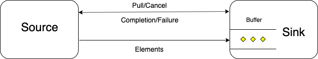
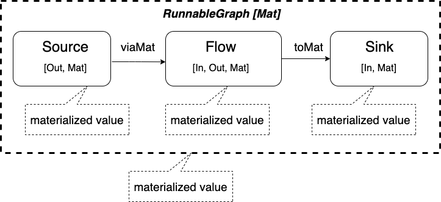

# Basic Concepts

Akka Streams 是基于 Akka Actor 的反应式流处理 (reactive stream processing) 开源库。Akka Streams 库不仅提高了丰富的流数据处理功能，更为重要的是其提供了具有分形组合 Fractal Composition 能力的 Graph DSL，让开发者可以定制组合任意拓扑形状和功能的模块。设计和实现具有分形组合功能的 API 实现绝非易事，在最初的几年里 Akka Streams 的开发者重写了六遍才成为我们今天看到的样子。参见 [Reactive Streams, j.u.concurrent, & beyond!](https://www.infoq.com/presentations/streams-jdk/), 23 分 20 秒的视频。另一个贡献者 [Kerr](https://github.com/hepin1989) 告诉我实际是重写了七遍。其强大灵活的功能让初学者也容易发生见树不见林的情况。解锁的钥匙和学习其它复杂软件系统一样：建立清晰的概念，了解其基本实现机制，外加从简到繁的反复编码。本文试着对 Akka Streams 的一些主要概念给出定义，解释其背后的设计理念与实现机理，并在此基础上写出 Akka Streams 版的 Hello World 程序。

## 1 主要概念

Akka Streams 有很多重要的概念，理解其含义、设计理念和运作机理对于开发很有帮助。可是 [Akka Streams 文档](https://doc.akka.io/docs/akka/current/stream/) 没有准确地定义诸多基本概念。为了方便理解和致敬写了六次才定型的系统，这些概念又可以分为六个核心概念和建立在核心概念上的六个基础概念（六个纯属巧合）。核心概念比较抽象，而基础概念通常有具体实现。

### 1.1 核心概念

下面列表是核心概念的定义。概念后面括弧里的为中文翻译，没有统一规范，列出来仅仅是帮助理解。为了避免词不达意，Lost in Translation，以后这些概念出现时还是用其英文单词以避免歧义。

- Element (数据单元)： 一个单位的数据。可以是几乎任何类型的数据，比如一个数字、字母或一条包含所有订单信息的记录。但是数据不可以是 `null`。应用程序决定数据的类型和大小。因为需要在网络间传输，element 应支持 serialization（序列化）和 deseerialization（反序列化）。当谈到流量控制和缓存大小时，指的是多少个 Element，而不是具体的 byte 字节的多少，因而和数据类型紧密相关。
- Stream 或 Data Stream（流或数据流）：一串按相对时间先后次序排列的有限或无限的 element。
- Stream 或 Processing Stream（流或处理流）：一串数据流经各个处理模块。可以看到，Stream 有时代表数据流，有时代表处理流。多数情况下都可以从上下文区分其指代的概念。
- Backpressure（回压）：Stream 按照数据流向可以看成为从上到下的一个流。相连的二个处理模块之间的数据发送是由下游驱动。如果下游没有 pull （拉）请求，如同产生逆向的压力，则上游的数据不应该 push（推）到下游。
- Shape（形状）：Akka streams 用图形描述处理流，因而每个处理模块都会有 Shape Shape 包含了所有的输入端口和所有的输出端口。输入端口和输出端口的数据类型及其连接方式决定了数据的处理路径。
- Graph (图)：一个流处理拓扑图中的基本模块或其组合。一个 Graph 包含了描述数据处理路径的 Shape，增加了处理属性（Attribute），比如定义异步边界、缓存参数等。多个小的 Graph 按照一定规则连接其输入输出端口可以 composite （组合）成各种拓扑结构的大 Graph。多个大 Graph 可以组合成更大的 Graph。Graph 可以看成是 Akka Streams 的 Fractal 分形。
- GraphStage(图步)：GraphStage 是 Graph 的子类，增加了具体数据处理逻辑。在 Akka Streams 的文档里面，很多时候说 Graph 的数据处理其实是指 GraphStage 的处理功能。
- Operator（操作符）：GraphStage 的处理功能可以通过 Scala 的 `implicit class` 成为 Graph 的扩展方法，这些方法称为 Operator。

可以看到上面这些核心概念涵盖了数据流（element, stream）、流的组合（shape， graph）、流数据处理（GraphStage, Operator），以及流量控制（backpressure）。所有的程序的可以看成包含二个核心概念：数据结构和函数。Akka streams 的数据结构是基于回压的数据流组合成的各种图，其函数则是对图中数据流的操作。

### 1.2 基础概念

在核心概念的基础上，Akka Streams 开发了流处理库的各种功能实现。一个简单的线性处理流程可以简化成三个基础概念：

- Source (源点)：只有一个输出端口的 Graph/Operator，代表各种形态的数据生产者。比如文件，网络，定时器，鼠标操作等。Source 代表数据的发布者（Publisher），会异步的产生数据，可以终止或永不终止。
- Sink（终点）：只有一个输入端口的 Graph/Operator，代表各种形态的数据消费者，比如打印，显式，结果计算等。Sink 代表数据的最终订阅者（Subscriber）。通常随着 Source 的终止而终止，也可以取消订阅。
- Flow（管道）：只有一个输入端口和一个输出端口的 Graph/Operator，代表了一个流处理的中间环节。

从定义可以看出，Source 的输出和 Flow 的输入连接后的组合是一个 Souce。同理，Flow 和 Sink 的组合是一个 Sink，而多个 Flow 的组合是一个 Flow。 一个流有二个方向：从 Sink 指向 Source 的方向是 `upstream` （上游），从 Source 指向 Sink 为 `downstream` （下游）。

Akka Streams 把 Graph 的创建和执行分开，因而引出下面三个基础概念：

- RunnableGraph（可执行图）：一个 runnable（可执行）Graph 的基本要求是必须始于一个或多个 Source 而终于一个或多个 Sink 且所有的输入输出端口都按规则完全连接。在 Source 和 Sink 中间有多少 Graph，其连接形状如何则没有关系。完全连接的要求是指在创建 Graph 的过程中需要按照数据流向和数据类型连接所有的输入端口和输出端口。因此 RunnableGraph 中不存在没有输入连接的输入端口，也不存在没有输出连接的输出端口。
- Materialization（实体化）：分配系统资源并运行一个 RunnableGraph 来运行流处理的过程。RunnableGraph 是一个 blueprint（蓝图），如同函数的定义一样，只是定义了数据的处理方式，但是需要 Materializatioin 来运行实际数据处理。
- Materialized Value（实体化值）：当 materialize 一个 RunnableGraph 时，每个 operator/graph 会产生一个 materialized value。不同于流中的正常数据 element，这个 materialized value 可以是任何 materializaion 感兴趣的值：比如处理时间，处理的个数，处理的结果，运行的状态等等任何结果。实体化值可以和处理的数据有关或无关，有时候甚至是 `NotUsed`，代表不需要这个值。

一个 RunnableGraph 一旦生成，是 immutable （不可变）但是可以多次 Materializing 实体化执行。每次执行之间都是独立的。Materializing 负责准备运行所需要的各种资源比如文件、网络、内存和线程等，并启动运行。Materializaion 可以看成是运行环境和控制系统，因而有时候需要数据来管理运行。Akka Streams 设计成每个 Graph 都会产生一个 materialized value 来满足这方面的要求。因此一个 Source 需要指定二个数据类型 `Source[Out, Mat]`：输出数据类型和 materialized value 类型。同理，一个 Sink 需要指定一个输入数据类型和一个 materialized value 类型 `Sink[In, Mat]`；一个 Flow 则需要三个数据类型 `Flow[In, Out, Mat]`： 分别对应输入、输出和 materialized value。一个 RunnableGraph 是不可变的，但是可以多次实体化处理不同数据并生成不同的实体化值。

为了方便起见，一个 Stream（流）可以堪称包含了一系列 Element（数据单元）以及在各个 Segment 的 Processing（处理）。当不需要个别区分时，Source， Sink， Flow， Graph， Runnable Graph，以及 Operator 统称为处理单元 （processing unit）。

### 1.3 API 层次

Akka Streams 的文档对初学者并不友好的一个原因是一开始在 [Streams Quickstart Guide](https://doc.akka.io/docs/akka/current/stream/stream-quickstart.html) 就把低层次的 API 以及复杂的拓扑结构用到入门的代码例子中，因而让学习曲线变得没有必要的陡峭。其实 Akka Streams 库有很好的 API 层次设计。其 API 可以分成三大类

- 高级的 Flow DSL API
- 中级的 Graph DSLAPI
- 低级的 GraphStage DSL。

Akka Streams 文档中并没有 Flow DSL 这个概念，是本文创造的一个帮助理解的词。那些只使用现有的 Operators，通过简单的线性组合方式使用的 API 统称为 Flow DSL 高级 API。由于 Akka Streams 提供了数以百计各种功能的 Operators，利用这些 Opertor 的简单线性组合已经能满足很多的日常数据处理要求，而且不容易出错，因此高级 API 是开发人员的首选。

当线性结构或已有的简单数据处理拓扑结构不能满足要求时，可以采用 Graph DSL 来组合已有的 Operators 组成任意拓扑结构的 Graph。这是中级 API。中级 API 提供了建立各种拓扑结构的工具。

当需要定制有新的处理功能的 Operator 时，采用 GraphStage DSL 来定制 Graph 的内部处理逻辑和输入输出接口处理。GraphStage DSL 提供了状态维护、流量控制、接口定义等各种低级 API。这些 API 有复杂的处理模式但是提供了最大的灵活性。

明白这种分层的好处是初学者可以从简单易学的高级 Flow DSL 开始，掌握了一些基本概念之后，再接触中级 Graph DSL 和低级 GraphStage DSL 会变得相对容易。

这种层次结构也解释了 Akka Streams 文档里面经常交替使用的三个相似的概念： Graph， Operator，Stage。Graph 偏重模块的图形拓扑维度，Operator 偏重模块的数据处理维度，Stage 则强调模块在流处理中的可组合属性。多数情况下这些概念可以互换，都是用于描述流处理中的可以被灵活组合的一个 Component（组件）。

## 2 Stream 和 Backpressure

最简单的流处理包含一个 Source 和一个 Sink。其交互模式如下：



首先可以看到在 Source 和 Sink 之间有二条通信通道，一条是单向的 Elements 数据通道，从 Source 到 Sink。 另一条是双向控制信号通道。Sink 可以发送 Pull 请求和 Cancel 请求。Source 可以发送 Completion 请求 和 Failure 请求。这三种控制信号概括了所有的上下游的交互模式，可以推广到包含 Flow 在内各种 Graph/Operator 交互。Cancel， Completion， Failure 中任何一个信号的出现都意味着上下游连接关系的正常或非正常结束。

Akka Streams 采用 backpressure 流量控制机制。当 Sink 发出 Pull 请求时，Source 才会 Push element 给 Sink。由于 Akka Streams 的分布式设计，Source 和 Sink 可能在不同的线程甚至不同计算机，考虑到效率，接收端会有一个 Buffer 来批量请求和接收数据。缺省为缓存 16 个 elements。初始运行时，Sink 会发出一个 Pull 请求 Buffer 尺寸大小的 Elements，Source 在数据可用时会持续发送。如果 Sink 处理速度慢而 Buffer 已满，则 Source 未接到新的 Pull 请求时停止发送。如果 Sink 处理了一半的 Buffer，则会发送下一个 Pull 请求 Source 发送 eleemnts 填满完成的那一半。Buffer 的尺寸以及溢出策略在组合 Graph 时可以设置。这种 backpressure 机制做用于 RunnableGraph 里面的所有连接，每一个上游都会受其下游的 backpressure 流量控制。这样保证了端到端的流量控制策略。如果 Sink 是用户屏幕，在用户滚动到下一屏之前，Source 不会发送超过接收端 Buffer 尺寸的数据。很难想象，如此简单的 backpressure 机制，再配合几种简单的 overflow 溢出处理策略竟然优雅高效地完成了看似复杂而非常有用的端到端流量控制。

有必要说明，Operators 可以在不同的线程甚至不同 JVM 里面，这种称为不同的 async boundary（异步边界）。最初的 Akka Streams 版本里每个 Operator 都在不同的 Akka Actor 里面运行。Operators 在不同线程运行有些情况下可以增加并发度，进而提高处理效率和吞吐量。从 Akka Streams 2.5 开始，当组合 operators 时，如果不调用 `async()` 方法，这些 operators 会运行在同一个 async boundary，也就是同一个 Akka Actor 里面。作为一个优化手段，如果上下游的 operators 在同一个 async boundary 里面，也就是运行在同一个线程里面，那么上述的 Buffer 和流处理机制就简化掉了，Akka Streams 称其为 Fusion （聚合）。Fusion 模式时上下游 Operators 之间直接用共享内存访问 elements，省却了流量控制的麻烦。

## 3 Materialization 和 Materialized Value

Materialization 就是分配系统资源来运行一个始于 Source 终于 Sink 的 RunnableGraph。其中的一个主要任务就是提供运行 RunnableGrapsh 的线程池。`RunnableGraph` 类有一个 `def run()(implicit materializer: Materializer): Mat = materializer.materialize(this)` 方法。可见其用一个 implicit `Materializer` 来运行一个 RunnableGraph。从 Akka Streams 2.6 版开始，当创建一个 implicit `ActorSystem` 的时候，Akka Streams 的缺省配置会用一个 [`Akka.actor.Extension`](https://doc.akka.io/api/akka/current/akka/actor/Extension.html) 自动创建一个 implicit `Materializer`。因此只要在当前环境中创建了一个 implicit `ActorSystem` 就可以运行 Materialization 了。运行时候，RunnableGraph 里面的每一个 Operator 都会在 stream 的正常 elements 之外产生一个 Materialized value， 如下图所示：



图中包含三个 Operators：Source， Flow， 和 Sink。 每一个都会产生一个 materialized value。当组合二个 Operator 时需要指定保留哪个值。每个组合方法会额外要求一个形式为 `(Mat, Mat2) => Mat3` 的函数作为参数，从二个 materialized values 产生一个新的值。通常这个值可以是第一个，第二个，二个的组合或返回 `NotUsed`。 Akka Streams 提供了四个帮助函数： `Keep.left`, `Keep.right`, `Keep.both`, `Keep.none`。

对 `Source`, `Flow` 和 `Sink` 这三种基本 Graph，Akka Streams 提供了二种基本组合方法：用 `viaMat` 连接下一个 `Flow`, 用 `toMat` 连接最终的 `Sink`。最后组合 Sink 的 `toMat` 方法返回的 materialized value 会作为整个 RunnableGraph 的 materialized value。

## 4 Hello World

到此终于有足够的理论基础写 Akka Streams 版本的 “Hello World”，代码如下：

```scala
implicit val system = ActorSystem("helloWorld")

val source: Source[String, NotUsed] = Source.single("Hello World")
val sink: Sink[String, Future[Done]] = Sink.foreach[String](println)

val runnableGraph: RunnableGraph[Future[Done]] = source.toMat(sink)(Keep.right)
val matValue: Future[Done] = runnableGraph.run()

implicit val ec = scala.concurrent.ExecutionContext.Implicits.global
matValue.onComplete(_ => system.terminate())
```

Akka Streams 运行在 Akka Actor 系统上，因此需要创建一个 implicit `ActorSystem`。`ActorSystem("helloWorld")` 的调用同时也创建了一个 implicit `Materializer` 实例，该实例提供了后面 `runnableGraph.run()` 方法的第二个隐含参数。

`Source.single("Hello World")` 是产生一个单一 element 的 Soruce， 可以看到其返回的结果是一个类型为 `Source[String, NotUsed]` 的值，输出的数据类型为 `String`, materialized value 类型为 `NotUsed`，代表一个没用的值。

`Sink.foreach[String](println)` 则生成一个 Sink 值。该实例打印每一个输入的字符串，在整个流处理运行完成之后会产生一个类型为 `Future[Done]` 的 materialized value。所以其对应的数据类型为 `Sink[String, Future[Done]]`。

下一语句中的 `source.toMat(sink)(Keep.right)` 则通过 `Source.toMat`方法把 Source 的输出和 Sink 的输入连接起来，从而创建了一个 RunnableGraph 值，其类型为 `RunnableGraph[Future[Done]]`。因为 `toMat` 方法右边是 Sink，其 materialized value 类型是 `Future[Done]` 而 `toMat` 的第二个参数是 `Keep.right`，因此 RunnableGraph 最终的 materialized value 类型是 `Future[Done]`。 如果 `toMat` 的第二个参数是 `Keep.left`， 则最终 materialized value 类型会成为 `NotUsed`。如果 `toMat` 的第二个参数是 `Keep.both`， 则最终 materialized value 类型会成为一个 tuple 值 `(NotUsed, Future[Done])`。在本例中，因为 Sink 的 materialized value 可以用于知道打印完成的时机用于清理 Akka Actor 的系统资源，所以采用了 `Keep.left` 来获得这个值。

`runnableGraph.run()` 利用 `Materializer` 提供的线程池来异步运行数据处理功能。会和定义组合 Graph 的代码不在同一线程。

`Future.onComplete()` 回调函数第二个参数是一个隐含的 ExectuionContext 执行环境参数。`implicit val ec = scala.concurrent.ExecutionContext.Implicits.global` 提供了所需的参数值。另外一个可用的选择是 `implicit val ec = system.dispatcher`，即使用现成的 ActorSytem 自带的 ExectuionContext。最后一句 `matValue.onComplete(_ => system.terminate())`  终止程序运行。

如 `source.toMat(sink)(Keep.right)` 所展示的，因为连接到 Sink 并保留 Sink 的 materialized value 是个常见的模式， Akka Streams 提供了一个简单的方法 `runWith()` 来合并连接与运行。也就是说 `source.runWith(sink)` 是 `source.toMat(sink)(Keep.right).run()` 的简化版。相关程序简化如下：

```scala
val source: Source[String, NotUsed] = Source.single("Hello World")
val sink: Sink[String, Future[Done]] = Sink.foreach[String](println)

val matValue: Future[Done] = source.runWith(sink)
```

更进一步，因为 `Sink.foreach` 常用于数据的最终处理，Source 提供了简捷的 `runForeach` 方法来做上述繁琐的步骤。也就是说 `source.runForeach(println)` 等同于 `source.runWith(Sink.foreach(println))`, 也等同于更长的 `source.toMat(Sink.foreach(println))(Keep.right).run()`. 这一个 `runForEach` 方法完成了创建 Sink， 连接 Sink 以及运行整个 RunnableGrpah 的诸多步骤。类似的快捷模式在 Akka Streams API 里面很常见。一旦理解其实现原理，可以看到 Akka Streams API 的系统设计具有高度一致性。

去掉中间变量和类型标注，完整的可运行简化版如下：

```scala
package com.sample

import akka.actor.ActorSystem
import akka.stream.scaladsl.Source

object HelloWorld extends App {
  implicit val system = ActorSystem("helloWorld")

  val matValue = Source.single("Hello World").runForeach(println)

  implicit val ec = scala.concurrent.ExecutionContext.Implicits.global
  matValue.onComplete(_ => system.terminate())
}
```

值得注意的是，作为面向分布式异步执行的系统，上面四行代码牵涉到三个 `ExecutionContext`： Akka Actor 的 ActorSystem，Akka Streams 的 Materializer，以及 Future 的回调执行。Akka Streams 的 Materializer 缺省使用 ActorSystem 的运行环境，所以本例中实际用到二个执行环境。使用 `scala.concurrent.ExecutionContext.Implicits.global` 而不是复用 `system.dispatcher`, 在本例这种简单情况没有必要。之所以这么做是为了表明在实际系统开发中，为了避免干扰 Akka Streams 的本身运作，应用程序自身用到的异步操作应该配置使用额外的、适合其本身特点（CPU 密集或 IO 密集）的线程池作为执行环境。

Hello world，欢迎来到一个异步、并发、不会过劳而崩的世界！
