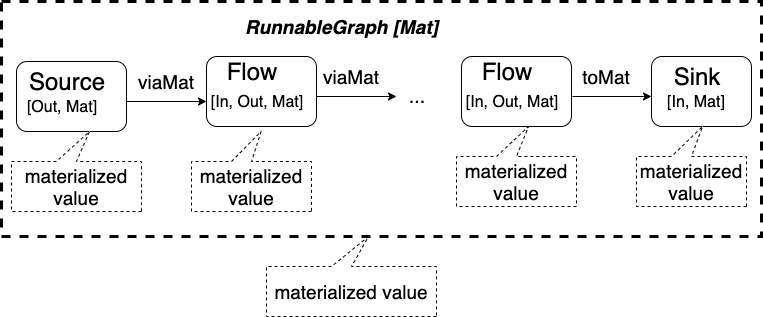

# Operator Composition

一个 Stream 通常会有多个处理环节。往下，每个处理环节可以分解为更细的处理步骤。往上，每个处理环节也可以看成是更大的处理环节的一部分。因此 Stream 处理会有不同层次的抽象。多个 Stream 的处理流程或者不同的抽象层次会共享一些处理功能，处理模块必须可以按照业务需要进行组合。强大、灵活的模块组合是 Akka Streams 最重要的功能之一。本文介绍了基本的线性组合以及给出相应代码例子。

## 1 基本 Operator

Akka Streams 有三个基本的 Opertors：

- Source (源点)：只有一个输出端口的 Graph/Operator，代表各种形态的数据生产者。比如文件，网络，定时器，鼠标操作等。
- Sink（终点）：只有一个输入端口的 Graph/Operator，代表各种形态的数据消费者，比如打印，显式，结果计算等。
- Flow（管道）：只有一个输入端口和一个输出端口的 Graph/Operator，代表了一个流处理的中间环节。

Akka Streams 区分不可变的流处理蓝图（blueprint）和其运行（materialization）。每个 Operator 在 Materaialization 时会产生一个 materialized value。在后面的例子可以看到，这个 materialized value 可以是各种与 stream 中的 element 有关或无关的任何值，包括无用值 `NotUsed`。

### 1.1 Source

Source 代表了数据源或生产者。Akka Streams 在 Source 的伴生对象里定义了很多创建 Source 的工厂方法。下面是一些常用于生产演示数据的方法：

- `Source.apply`: 其类型为 `Iterable[T] => Source[T, NotUsed]`, 即从一个 `Iterable` 参数创建一个 Source 对象，其中的 element 数据类型和 Iterable 一致，materialized value 则为无用值 `NotUsed`。`Source(1 to 10)` 创建了一个 `Source[Int, NotUsed]` 的对象，会产生从 1 到 10 的 10 个整数。`Source(LazyList.from(1))` 利用 `LazyList` 产生从 1 开始的无穷序列整数。
- `Soruce.single`: 其类型为 `[T] => Source[T, NotUsed]`, 即从单个数据参数创建一个只有一个 element 的 Source 对象。比如 `Source.single("Hello World")` 会产生一个 `"Hello World"` 字符串。
- `Soruce.repeat`: 其类型为 `[T] => Source[T, NotUsed]`, 即从单个数据参数创建一个无限重复输入参数的 Source 对象。比如 `Source.repeat(42)` 会产生一个无限的数据流 `42 42 42 ....`。
- `Source.tick`: 其类型为 `[FiniteDuration, FiniteDuration, T] => Source[T, Cancellable]`, 即从单个数据参数创建一个定时产生 element 的 Source 对象。比如 `Source.tick(1.second，3.seconds， 42)` 会从 1 秒后开始每隔 3 秒钟产生一个 42。注意，此时的 materialized value 是一个可以用于取消该数据源的 `Cancellable` 对象。

### 1.2 Flow

Flow 代表了有一个输入和一个输出的 Operator，因而有代表输入，输出和 maeterialized value 的三个数据类型 `Flow[In, Out, Mat]`。 Flow 定义了很多方法，可以通过 `Flow[T]` 来调用，`T` 是输入端口的 element 的数据类型。stream 很多情况下可以看成一个数据集合，因此可以看到常见的集合方法比如：

- `map[T](f: Out => T)`: 用转换函数处理每一个 element。此处 `T` 是处理后的输出端口的 element 数据类型。比如 `Flow[Int](_ + 1)` 给每个 element 加一。
- `filter(p: Out => Boolean)`: 用过滤函数处理每一个 element，只有过滤函数返回 `true` 时才把收到的 element 送往下游。比如 `Flow[Int].filter(_ % 2 == 0)` 只让偶数通过。
- `take(n: Long)`: 只取前 n 个 element，然后向上游发出 cancel 信号并结束处理。
- `fold[T](zero: T)(f: (T, Out) => T)`: 类似集合的 `fold` 方法，以 `zero` 为初始值用指定的方法处理每个 element 直到上游完成。此处 `T` 是处理后的输出端口的 element 数据类型。比如 `Flow[Int].fold(0)(_ + _)` 计算总和。如果第一个元素作为初始值，则可以用简化的 `Flow[Int].reduce(_ + _)`。
- `log(name: String)`: 日志记录 element 以及完成和错误信号。element 和 完成用 debug 级别，错误信号用 error 级别。日志级别以及日志对象都可以配置。

在具体实现中，`Flow.apply[T]` 返回一个类型为 `Flow[T, T, NotUsed]` 对象，该对象只是简单的把 element 传给下游，不做任何处理。Flow 类的很多方法其实是生成了新的 Operator 来处理数据，所以输出以及 materialized value 的类型也会发生变化。上面所列方法的 materialized value 值是 `NotUsed`。

### 1.3 Sink

`Sink[In, Mat]` 通常代表数据处理的终点，其定义包含了一个输入数据类型和 materialized value 数据类型。其数据处理方法多定义在伴生对象上。常用的方法如下：

- `foreach[T](f: T => Unit): Sink[T, Future[Done]]`: 对每个输入的 element 运行指定的函数。因为是数据处理的终点，所以指定的函数也返回空值 `Unit`。常用的例子是 `foreach(println)` 打印最终的结果。Materialized value 是一个 `Future` 值。stream 正常结束时, Future 返回 `Success(Done)`, 否则返回 `Failure(error)`。这个返回值可以用于判断 Materialization 完成的时机和状态。
- `ignore: Sink[Any, Future[Done]]`: 丢弃收到的 element。
- `head[T]: Sink[T, Future[T]]`: 把第一个 element 放入 `Future` 作为运行完成后的 materializaed value。
- `last[T]: Sink[T, Future[T]]`: 把最后一个 element 放入 `Future` 作为运行完成后的 materializaed value。
- `fold[U, T](zero: U)(f: (U, T) => U): Sink[T, Future[U]]` 把 fold 的结果放入 `Future` 作为运行完成后的 materializaed value。
- `onComplete[T](callback: Try[Done] => Unit): Sink[T, NotUsed]`: Materializaion 完成时，以完成的状态 `Try[Done]` 为参数运行回调函数。

### 1.4 例子

下面给出一些 Operator 例子，在后面用于说明不同的组合方式。

```scala
// a source generate numbers from 1 to 10， 也可以写成 Source[Int](1 to 10)
val oneToTenSource: Source[Int, NotUsed] = Source[Int](1 to 10)
val helloSource: Source[String, NotUsed] = Source.single("Hello World")

// print element of Int type, the foreach method comes with an Int type
val printIntSink: Sink[Int, Future[Done]] = Sink.foreach[Int](println)

// print element of Any type, notice that foreach method doesn't have a type
val printAnySink: Sink[Any, Future[Done]] = Sink.foreach(println)

// it is recommended to give the data type. notice that foreach method has a type tag
val printStrSink: Sink[String, Future[Done]] = Sink.foreach[String](println)

// calculate the sum of all elements
val sumSink: Sink[Int, Future[Int]] = Sink.fold[Int, Int](0)(_ + _)

// add one to each element
val addOneFlow: Flow[Int, Int, NotUsed] = Flow[Int].map[Int](_ + 1)

// convert an Int into a string
val intToStrFlow: Flow[Int, String, NotUsed] =
Flow[Int].map[String](_.toString)

// get string length
val strLengthFlow: Flow[String, Int, NotUsed] =
Flow[String].map[Int](_.length)
```

上面每个 Opertor 都给出来相应的输入，输出以及 MAT 类型。多数的方法都可以标注类型说明，比如 `Source(1 to 10)` 可以写成 `Source[Int](1 to 10)`，`Flow[String].map(_.length)` 可以写成 `Flow[String].map[Int](_.length)`。这二例中的方法（第一个其实是`Source.apply[T]`）的方法类型都可以省略是因为 Scala 编译器可以推断出正确的数据类型。有时候省略数据类型会得到不同的结果。比如 `Sink.foreach[Int](println)` 和 `Sink.foreach(println)` 创建了不同类型的结果：一个是 `Sink[Int, Future[Done]]` 打印整数，而另一个是 `Sink[Any, Future[Done]]` 可以接受任何类型的参数。谨慎起见，最好还是在方法上给出具体的数据类型。

## 2 基本组合

Akka Streams 提供了二个基本组合方法：`viaMat` 和 `toMat`。其使用方法可以参考下图：



Akka Streams 流处理的最小可运行单位称为一个 runnable Grpah（可执行图）。一个 runnable Graph 的基本要求是必须始于一个只有一个输出的 Source 而终于一个只有一个输入的 Sink。如上图所示，通常一个 runnable Graph 中间还包括一个或多个只有一个输入和一个输出的 Flow（管道），且所有的输入输出端口都按完全连接。

`viaMat` 用于连接 Source 或 Flow 的输出端口到 Flow 的输入端口，`toMat` 用于连接一个 Source 或 Flow 的输出端口到 Sink 的输入端口。Stream 中的 Elements 通过相连的输入输出端口流动，Materialization 运行时按照 runnable Graph 蓝图描述的处理逻辑被各个 Operator 处理。`viaMat` 与 `toMat` 由于连接了二个 Opertors，会需要一个额外的参数 `combine: (Mat, Mat2) => Mat3` 从其连接的二个 Operator 的 materializaed value 生成组合后的 materialized value。

`toMat` 方法的结果是 `RunnableGraph[Mat]`, 其中的 `Mat` 是整个 runnable Graph 的 materialized value 的数据类型。调用 `RunnableGraph.run()` 来运行 Materialization。

下面例子中的所有的 Operators 都来自前面的定义。

### 2.1 Source + Sink = RunnableGraph

一个 runnable Grpah（可执行图）需要一个 Source 和一个 Sink。

```scala
// Source + Sink = RunnableGraph
val helloRunnable: RunnableGraph[Future[Done]] =
helloSource.toMat(printAnySink)(Keep.right)
val helloMaterialized: Future[Done] = helloRunnable.run()

val sumRunnable: RunnableGraph[Future[Int]] =
oneToTenSource.toMat(sumSink)(Keep.right)
val sumMaterialized: Future[Int] = sumRunnable.run()

// type mismatch, doesn't compile
// helloSource.viaMat(printIntSink)
```

在 `val helloRunnable: RunnableGraph[Future[Done]] = helloSource.toMat(printAnySink)(Keep.right)` 这个简单的组合有二个需要注意的地方。第一，相连的输入与输出需要有匹配的数据类型。`helloSource` 的输出是 `String`， 而 `printAnySink` 的输入是 `Any`，所以组合没有问题。如果改成 `helloSource.viaMat(printIntSink)`，则因为输出是 `String`， 而 `printIntSink` 的输入是 `Int` 造成数据类型不匹配而无法编译。其次，`toMat(sink)(combine)` 有二个参数，第一个参数是连接的 Sink，第二个参数 `combine` 是一个组合函数。 `combine` 的类型是 `(Mat, Mat2) => Mat3`，该函数从 `toMat` 左边 Operator 和右边 Operator 的二个 materialized value 组合生成最终的 materialized value。此处保留了右边也就是 Sink 的 materialized value 因而最终的结果是 `RunnableGraph[Future[Done]]`。运行后的结果就是 `val helloMaterialized: Future[Done] = helloRunnable.run()`。这个 `Future[Done]` 结果可以用于二个目的：Materialization 结束是可以运行 callback（回调函数），返回结果是个 `Try[Done]` 数据类型可以用于判断运行的状态是 `Success` 还是 `Failure`。

在 `val sumRunnable: RunnableGraph[Future[Int]] = oneToTenSource.toMat(sumSink)(Keep.right)` 例子中，Materialization 的执行是 `val sumMaterialized: Future[Int] = sumRunnable.run()`，其结果是数据的总和。需要返回什么样的 materialized value 完全是按照应用的需要来定义。

### 2.2 Source + Flow = Flow

一个 Source 和一个 Flow 组合成一个新的 Source，输出数据类型也变成 Flow 的输出数据类型。如下例所示：

```scala
val addOneSource: Source[Int, NotUsed] = oneToTenSource.viaMat(addOneFlow)(Keep.left)
val oneToTenStrSource: Source[String, NotUsed] = oneToTenSource.viaMat(intToStrFlow)(Keep.left)
```

可以看到 `oneToTenSource.viaMat(intToStrFlow)` 组合中, 数据类型由 `Source[Int, NotUsed]` 变成 `Source[String, NotUsed]`。由于 `viaMat` 二边的 materialized value 类型都是 `NotUsed`，所以用 `Keep.left` 和用 `Keep.right` 没有差别。

### 2.3 Flow + Sink = Sink

一个 Flow 和一个 Sink 组合成一个新的 Sink，输入数据类型也变成 Flow 的输入数据类型。

```scala
val addOneSink: Sink[Int, NotUsed] = addOneFlow.toMat(printIntSink)(Keep.left)
val intToStrSink: Sink[Int, Future[Done]] = intToStrFlow.toMat(printStrSink)(Keep.right)
```

组合后的 `addOneSink` 输入类型为 `addOneFlow` 的输入类型 `Int`。其 Mat 类型为左边 `addOneFlow` 的 Mat 类型 `NotUsed`。组合后的 `intToStrSink` 输入类型为 `intToStrFlow` 的输入类型 `String`。其 Mat 类型为右边 `printStrSink` 的 Mat 类型 `Future[Done]`。

### 2.4 Flow + Flow = Flow

一个 Flow 和一个 Sink 组合成一个新的 Flow。第一个 Flow 的输入和第二个 Flow 的输出成为新 Flow 的输入输出。

```scala
val addOneStrFlow: Flow[Int, String, NotUsed] =
  addOneFlow.viaMat(intToStrFlow)(Keep.left)

val intLenFlow: Flow[Int, Int, NotUsed] =
  intToStrFlow.viaMat(strLengthFlow)(Keep.left)
```

### 2.5 Source + Flow(s) + Sink = RunnableGraph

通常的流处理包含一个 Source， 一个或多个 Flow，终结于一个 Sink，最终是一个可以执行 `run()` 来完成 Materialization 的 RunnableGraph。最终的 Mat 数据类型是 `toMat` 组合最终的 Sink 时生成的 Mat 数据类型。

```scala
val addOneRunnable: RunnableGraph[NotUsed] =
  oneToTenSource.viaMat(addOneFlow)(Keep.left).toMat(printIntSink)(Keep.left)

val addOneSumRunnable: RunnableGraph[Future[Int]] =
  oneToTenSource
    .viaMat(addOneFlow)(Keep.left)
    .viaMat(addOneFlow)(Keep.left)
    .toMat(sumSink)(Keep.right)
```

第一个例子的 RunnableGraph 的 Mat 值用 `Keep.Left` 选择 `toMat` 左边 `addOneFlow` 的值。第二个则用 `Keep.right` 选择右边 `sumSink` 的值。同时因为所有的 Operator 都是 Immutable 的数据处理蓝图，可以在一个或多个 RunnableGraph 里面重复使用。

## 3 简化 API

可以看到很多的 Flow 的 Mat 值是 `NotUsed`，还有很多时候都在 RunnableGraph 中处理数据的正常或非正常情况，也不关心 最终 Materialzation 的结果。所以 Akka Streams 提供了一些简化 API 来减少代码量。常见的有：

- `via(flow)`: 作为 Source 或 Flow 的方法，等同于 `viaMat(flow)(Keep.left)`
- `to(sink)`: 作为 Source 或 Flow 的方法，等同于 `toMat(sink)(Keep.left)`
- `source.runWith(sink)`: 作为 Source 的方法，等同于 `source.toMat(sink)(Keep.right).run()`

稍复杂一些的还有：

- `sink.runWith(source)`: 等同于 `source.to(sink).run()`
- `sink.foreach[T](f: T => Unit)`: 等同于 `Flow[T].map(f).toMat(Sink.ignore)(Keep.right)`
- `sink.fold(zero: U)(f: (U, T) => U)`: 等同于 `Flow[T].fold(zero)(f).toMat(Sink.head)(Keep.right)`
- `source.runForeach(f: T => Unit)`： 等同于 `source.runWith(Sink.foreach(f)`
- `source.runFold(zero: U)(f: (U, Out)`: 等同于 `source.runWith(Sink.fold(zero)(f))`
- `flow.runWith(source, sink)`： 等同于 `source.via(flow).toMat(sink)(keep.both).run()`

可以看到，这些稍微复杂的 API 无非还是各种简单组合的组合。这些方法通常会创建需要的 Soruce， Flow，或 Sink 来组合成新的 Operator。一旦明白了基本组合，输入输出数据的接口匹配，以及 Mat 值的生成，简化的 API 和更复杂的组合也不难理解。下面是一些代码例子：

```scala
// shortcut for oneToTenSource.viaMat(addOneFlow)(Keep.left)
oneToTenSource.via(addOneFlow)

// shortcut for toMat(printIntSink)(Keep.left)
addOneFlow.to(printIntSink)

// shortcut for oneToTenSource.toMat(printIntSink)(Keep.right).run()
oneToTenSource.runWith(printIntSink)

// shortcut for
// oneToTenSource.viaMat(addOneFlow)(Keep.left).viaMat(addOneFlow)(Keep.left).toMat(printStrSink)(Keep.left)
oneToTenSource.via(addOneFlow).via(intToStrFlow).to(printStrSink)

// shortcut for
// oneToTenSource.via(addOneFlow).toMat(printIntSink)(Keep.both).run()
val result: (NotUsed, Future[Done]) =
  addOneFlow.runWith(oneToTenSource, printIntSink)
```

最后一例中的 `result` 类型为 `(NotUsed, Future[Done])`。这是因为 `Keep.both` 组合了二边的 Mat 值。

## 4 完整代码

本文用的所有代码如下：

```scala
package com.sample

import akka.actor.ActorSystem
import akka.{Done, NotUsed}
import akka.stream.scaladsl.{Flow, Keep, RunnableGraph, Sink, Source}

import scala.concurrent.Future

object Main extends App {

  implicit val system = ActorSystem("demo")
  implicit val ec = system.dispatcher

  // Sources

  // a source generate numbers from 1 to 10， 也可以写成 Source[Int](1 to 10)
  val oneToTenSource: Source[Int, NotUsed] = Source[Int](1 to 10)
  // a single string source
  val helloSource: Source[String, NotUsed] = Source.single("Hello World")

  // Sinks

  // print element of Int type, the foreach method comes with an Int type
  val printIntSink: Sink[Int, Future[Done]] = Sink.foreach[Int](println)

  // print element of Any type, notice that foreach method doesn't have a type
  val printAnySink: Sink[Any, Future[Done]] = Sink.foreach(println)

  // it is recommended to give the data type. notice that foreach method has a type tag
  val printStrSink: Sink[String, Future[Done]] = Sink.foreach[String](println)

  // calculate the sum of all elements
  val sumSink: Sink[Int, Future[Int]] = Sink.fold[Int, Int](0)(_ + _)

  // Flows

  // add one to each element
  val addOneFlow: Flow[Int, Int, NotUsed] = Flow[Int].map[Int](_ + 1)

  // convert an Int into a string
  val intToStrFlow: Flow[Int, String, NotUsed] =
    Flow[Int].map[String](_.toString)

  // get string length
  val strLengthFlow: Flow[String, Int, NotUsed] =
    Flow[String].map[Int](_.length)

  // Composition examples

  // Source + Sink = RunnableGraph
  val helloRunnable: RunnableGraph[Future[Done]] =
    helloSource.toMat(printAnySink)(Keep.right)
  val helloMaterialized: Future[Done] = helloRunnable.run()

  val sumRunnable: RunnableGraph[Future[Int]] =
    oneToTenSource.toMat(sumSink)(Keep.right)
  val sumMaterialized: Future[Int] = sumRunnable.run()

  // type mismatch, doesn't compile
  // helloSource.viaMat(printIntSink)

  // Source + Flow = Flow
  // 一个 Source 和一个 Flow 组合成一个新的 Source，输出数据类型也变成 Flow 的输出数据类型。
  val addOneSource: Source[Int, NotUsed] =
    oneToTenSource.viaMat(addOneFlow)(Keep.left)

  val oneToTenStrSource: Source[String, NotUsed] =
    oneToTenSource.viaMat(intToStrFlow)(Keep.left)

  // Flow + Sink = Sink
  // 一个 Flow 和一个 Sink 组合成一个新的 Sink，输入数据类型也变成 Flow 的输入数据类型。
  val addOneSink: Sink[Int, NotUsed] = addOneFlow.toMat(printIntSink)(Keep.left)
  val intToStrSink: Sink[Int, Future[Done]] =
    intToStrFlow.toMat(printStrSink)(Keep.right)

  // Flow + Flow = Flow
  // 第一个 Flow 的输入和第二个 Flow 的输出成为新 Flow 的输入输出
  val addOneStrFlow: Flow[Int, String, NotUsed] =
    addOneFlow.viaMat(intToStrFlow)(Keep.left)

  val intLenFlow: Flow[Int, Int, NotUsed] =
    intToStrFlow.viaMat(strLengthFlow)(Keep.left)

  // Source + Flow(s) + Sink = RunnableGraph
  val addOneRunnable: RunnableGraph[NotUsed] =
    oneToTenSource.viaMat(addOneFlow)(Keep.left).toMat(printIntSink)(Keep.left)

  val addOneSumRunnable: RunnableGraph[Future[Int]] =
    oneToTenSource
      .viaMat(addOneFlow)(Keep.left)
      .viaMat(addOneFlow)(Keep.left)
      .toMat(sumSink)(Keep.right)

  addOneSumRunnable.run().onComplete(println)

  // API shortcuts

  // shortcut for oneToTenSource.viaMat(addOneFlow)(Keep.left)
  oneToTenSource.via(addOneFlow)

  // shortcut for toMat(printIntSink)(Keep.left)
  addOneFlow.to(printIntSink)

  // shortcut for oneToTenSource.toMat(printIntSink)(Keep.right).run()
  oneToTenSource.runWith(printIntSink)

  // shortcut for
  // oneToTenSource.viaMat(addOneFlow)(Keep.left).viaMat(addOneFlow)(Keep.left).toMat(printStrSink)(Keep.left)
  oneToTenSource.via(addOneFlow).via(intToStrFlow).to(printStrSink)

  // shortcut for
  // oneToTenSource.via(addOneFlow).toMat(printIntSink)(Keep.both).run()
  val result: (NotUsed, Future[Done]) =
    addOneFlow.runWith(oneToTenSource, printIntSink)

}
```
