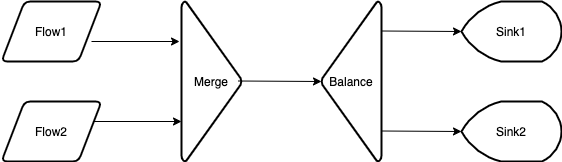
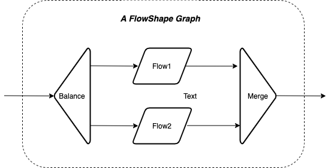

# Graph DSL

可以灵活的组合处理单元是 Akka Streams 的另外一个核心功能。当处理流程的图形不是从一个 Source 到零个或多个串行的 Flow 再到一个 Sink 的简单线性结构时，需要用 Akka Streams 提供的 Graph DSL（图形领域特定语言）来构造复杂非线性的处理拓扑结构。Graph DSL 提供了二种方式来构建非线性处理：利用已有的非线性 Shape 和定制有任意数量的入口和出口的 Shape。本文给出第一种的使用方法，定制 Shape 在下文介绍。

## 1 构建一个 `RunnableGraph` 可执行图

一个 `RunnableGraph` 可执行图如其名字所言，是一个可以实体化的 `Graph`。如前所述，一个 runnable（可执行）Graph 的基本要求是必须始于始于一个或多个 Source 而终于一个或多个 Sink 且所有的输入输出端口都按规则完全连接。本例中假设有二个快慢不一 `Source` 的数据单元需要发送到二个 `Sink` 打印。常见的场景是需要平衡工作量，二个简单的线性流程显然无法满足要求。为了平衡负载，需要先合并所有的输入数据再平衡的分发，如下图所示。



在 Akka Streams 里，所有的 `Graph` 图都从更基础的 `Shape` 形状来构造。图的构造过程自顶向下，可以分解为如下步骤.

### 1.1 组件及其组合形状

Akka Streams 可以灵活组合业务处理组件。这些业务处理组件在具体应用中可以是非常复杂耗时的。下面给出简单的演示组件，目的是演示灵活的组合方式。

```scala
// Step 1 基本组件
import scala.concurrent.duration._
val source1 = Source.repeat("Repeat").throttle(3, 1.second).take(7)
val source2 = Source.tick(0.second, 1.second, "Tick").take(3)

val sink1 = Sink.foreach[String](message => println(s"Sink 1: ${message}"))
val sink2 = Sink.foreach[String](message => println(s"Sink 2: ${message}"))
```

二个不同速率的数据源需要发送到二个处理终点。简单的线性 Flow DSL 无法满足上图的非线性处理需求。需要借助 Graph DSL 来定制。

### 1.2 构建的模版

Akka Streams 提供了 `RunnableGraph.fromGraph(g)` 方法来构建一个可执行图。这个方法的参数类型为 `Graph[ClosedShape, Mat]`，是个内含 `ClosedShape` 的 `Graph` 对象。

Akka Streams 提供了 `GraphDSL.create` 方法创建这个 `Graph` 参数。这个 `create` 方法是个 overloaded（重载）方法，有多个函数签名分别接受不同的参数。最简单的一个是 `def create[S <: Shape]()(buildBlock: GraphDSL.Builder[NotUsed] => S): Graph[S, NotUsed]`，这里只接受一个函数对象为参数 `buildBlock: GraphDSL.Builder[NotUsed] => S`。这个函数的参数类型是 `GraphDSL.Builder`，返回值类型用了 upper type bound 类型 `S <: Shape` 表示 `S` 是 `Shape` 的一个子类。

一个简单的基础构建模版如下：

```scala
// Step 2 基本构建模版
val graph = RunnableGraph.fromGraph(
  GraphDSL.create() { implicit builder: GraphDSL.Builder[NotUsed] =>
    // 构建一个 Shape
  }
)
```

### 1.3 构建形状

`Shape` 顾名思义，就是定义了图的形状，进而决定了所用的基本构件、构建操作符以及连接方式。根据需求，需要一个双输入单输出的 `Merge` 合并构件和一个单输入双输出的 `Balance` 平衡构件。一个 runnable（可执行）Graph 需要一个 `ClosedShapte`, 就是必须始于一个或多个 Source 而终于一个或多个 Sink，且所有处理组件的输入输出端口都按规则完全连接。其相关代码如下：

```scala
// Step 3 导入构建操作符
import GraphDSL.Implicits._

// Step 4 创建连接构件
val merge = builder.add(Merge[String](2))
val balance = builder.add(Balance[String](2))

// Step 5 连接功能组件和构件，所有的输入输出接口都全连接
source1 ~> merge ~> balance ~> sink1
source2 ~> merge
balance ~> sink2

// Step 6 返回形状类型
ClosedShape
```

可以看到构建形状包含了多个步骤，`import GraphDSL.Implicits._` 的目的是导入构建操作符。这些操作符比如用到的 `~>` 用于连接不同的**构件**或**组件**。其作用类似于 `viaMat` 或 `toMat` 这些方法，但是用于连接更基础的 Shape 形状构件。

特别声明一下，这里用了中文`构件`来指代那些类型为 `Shape` 的低级对象（object），`组件`则指代那些类型为 `Graph` 的高级数据处理对象（object）。

`builder.add(Merge[Int](2))` 和 `builder.add(Balance[Int, Int])` 分别创建了一个合并构件和一个平衡构件。`~>` 是个重载方法，既可以连接二个构件，也可以连接一个构件和一个组件，但是不可以两边都是组件。

最后一步是指明返回的形状类型，这里是 `ClosedShape`，表示一个全连接的可执行图。里面所有构件和组件的输入输出端口都完全连接。本例子中 `Merge` 有两个输入连接，一个输出连接，`Balance` 则有一个输入连接和二个输出连接。同样的，所有的 Source 和 Sink 也都完全连接。如果有任何一个未连接的端口会产生编译错误。

### 1.4 实体化运行

上面构建的可执行图可以实体化运行。完整的代码和输出如下。

```scala
import scala.util.Success
import akka.actor.ActorSystem
import akka.NotUsed
import akka.stream.ClosedShape
import akka.stream.scaladsl.{Balance, GraphDSL, Merge, RunnableGraph, Sink, Source, Zip}

object MergeBalance {
  def main(args: Array[String]) {
    implicit val system = ActorSystem("testStreams")
    implicit val ec = scala.concurrent.ExecutionContext.global

    // Step 1 基本组件
    import scala.concurrent.duration._
    val source1 = Source.repeat("Repeat").throttle(3, 1.second).take(7)
    val source2 = Source.tick(0.second, 1.second, "Tick").take(3)

    val sink1 = Sink.foreach[String](message => println(s"Sink 1: ${message}"))
    val sink2 = Sink.foreach[String](message => println(s"Sink 2: ${message}"))

    // Step 2 基本构建模版
    val graph = RunnableGraph.fromGraph(
      GraphDSL.create() { implicit builder: GraphDSL.Builder[NotUsed] =>
        // Step 3 导入构建操作符
        import GraphDSL.Implicits._

        // Step 4 创建连接构件
        val merge = builder.add(Merge[String](2))
        val balance = builder.add(Balance[String](2))

        // Step 5 连接功能组件和构件，所有的输入输出接口都全连接
        source1 ~> merge ~> balance ~> sink1
        source2 ~> merge
        balance ~> sink2

        // Step 6 返回形状类型
        ClosedShape
      }
    ) // RunnableGrpah

    graph.run()
  }
}

/* 输出结果
Sink 1: Repeat
Sink 2: Tick
Sink 1: Repeat
Sink 2: Repeat
Sink 1: Tick
Sink 2: Repeat
Sink 1: Repeat
Sink 2: Repeat
Sink 1: Repeat
Sink 2: Tick
 */
```

## 2 构建一个 `FlowShape` 图

利用 Graph DSL 不仅仅可以构建 `RunnableGraph`, 也可以构件其它用于 Flow DSL 的组件，比如 一个 `FlowShape` 图是一个可用于线性组合处理的单输入单输出组件。本例中假设每个数据单元都需要发送到二个不同的业务组件进行处理，然后把结果组合为一个 `Tuple` 数据。如下图所示：



在 Akka Streams 里，所有的 `Graph` 图都从更基础的 `Shape` 形状来构造。`FlowShape` 图的构造也不例外，可以分解为如下步骤.

### 2.1 基本业务组件

本例中假设每个数据单元都需要发送到二个独立的 `Flow` 分别处理。这二个组件定义如下：

```scala
// Step 1 基本组件
val flow1 = Flow[Int].map(_ * 10)
val flow2 = Flow[Int].map(_ * 100)
```

### 2.2 构建的模版

Akka Streams 提供了 `Flow.fromGraph(g)` 方法来构建一个 Flow 图。这个方法的参数类型为 `Graph[FlowShape[I, O], M]`，是个内含 `FlowShape` 的 `Graph` 对象。同样，可以用 `GraphDSL.create` 方法创建这个 `Graph` 参数。

一个简单的基础构建模版如下：

```scala
// Step 2 基本构建模版
val graph = Flow.fromGraph(
  GraphDSL.create() { implicit builder: GraphDSL.Builder[NotUsed] =>
    // 构建一个 Shape
  }
)
```

### 2.3 构建形状

`Shape` 定义了图的形状，也决定了所用的基本构件、构建操作符以及连接方式。根据需求，需要一个单输入双输出的 `Broadcast` 广播组件和一个双输入单输出的 `Zip` 拉链组件。一个 Flow Graph 需要一个 `FlowShape`, 就是必须有一个输入口和一个输出口，其内部的所有处理组件的输入输出端口都按规则完全连接。其相关代码如下：

```scala
// Step 3 导入构建操作符
import GraphDSL.Implicits._

// Step 4 创建连接构件
val broadcast = builder.add(Broadcast[Int](2))
val zip = builder.add(Zip[Int, Int])

// Step 5 连接功能组件和构件，连接相应的输入输出接口
broadcast ~> flow1 ~> zip.in0
broadcast ~> flow2 ~> zip.in1

// Step 6 返回形状类型
FlowShape(broadcast.in, zip.out)
```

此处有个小细节就是需要具体指定 `Zip` 的输入端口 `in0` 或 `in1`。这是因为作为一个 `FanInShape2`，构件操作符 `~>` 没有相应的重载方法。背后的考量估计是因为数据的位置决定了输出的类型。但是 `Broadcast`, `Balance`, `Meger` 这些形状的端口是一致的（Uniform），连接的顺序无关紧要，所以不需要指定具体端口。如果想指定，也可以如下所示，但是此处没有必要：

```scala
broadcast.out(0) ~> flow1 ~> zip.in0
broadcast.out(1) ~> flow2 ~> zip.in1
```

### 2.4 实体化运行

构造的 Flow Graph 可以像其它任何一个 `Flow` 对象一样用在线性的 Flow DSL 灵活组合。下面是完整的源码。

```scala
import akka.actor.ActorSystem
import akka.NotUsed
import akka.stream.FlowShape
import akka.stream.scaladsl.{Broadcast, Flow, GraphDSL, Sink, Source, Zip}

object FlowDemo {
  def main(args: Array[String]) {
    implicit val system = ActorSystem("testStreams")
    implicit val ec = scala.concurrent.ExecutionContext.global

    // Step 1 基本组件
    val flow1 = Flow[Int].map(_ * 10)
    val flow2 = Flow[Int].map(_ * 100)

    // Step 2 基本构建模版
    val flow = Flow.fromGraph(
      GraphDSL.create() { implicit builder: GraphDSL.Builder[NotUsed] =>
        // Step 3 导入构建操作符
        import GraphDSL.Implicits._

        // Step 4 创建连接构件
        val broadcast = builder.add(Broadcast[Int](2))
        val zip = builder.add(Zip[Int, Int])

        // Step 5 连接功能组件和构件，连接相应的输入输出接口
        broadcast ~> flow1 ~> zip.in0
        broadcast ~> flow2 ~> zip.in1

        // Step 6 返回形状类型
        FlowShape(broadcast.in, zip.out)
      }
    ) // Flow Grpah

    val source = Source(1 to 3)
    val sink = Sink.foreach[(Int, Int)](println)
    source.via(flow).runWith(sink)
  }
}

/* 输出结果
(10,100)
(20,200)
(30,300)
 */
```
