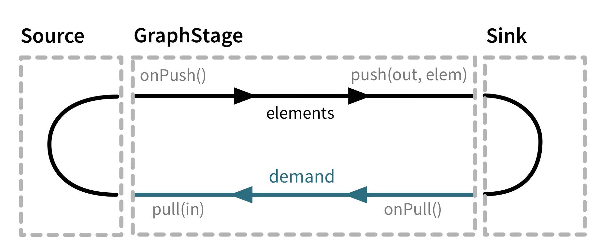

# Operators

Flow DSL 使用各种 Operators 以及 `viaMat`, `via`, `to`, `toMat` 这些连接构件来灵活的连接各种组件。其底层的功能则是通过 Graph DSL 以及 `GraphStage` （图步）来完成。`GraphStage` 是多数 Operator 的具体实现。本文通过给出一个 Operator 的实现例子，然后总结 GraphStage 的创建过程。最后给出 Operators 的大致分类。

所有的例子和图形都基于或来自 [Custom stream processing 官方文档](https://doc.akka.io/docs/akka/current/stream/stream-customize.html)，下面不另做说明。

## 1 Operator 的实现

利用 Scala 的 `implicit class`，可以很方便的把一些 GraphStage 转换为其它 Graph 的扩展方法。比如上一章的的 Duplicator 可以简单地转换为 `Soruce` 或 `Flow` 的一个扩展方法。

```scala

implicit class SourceDuplicator[Out, Mat](s: Source[Out, Mat]) {
  def duplicateElements: Source[Out, Mat] = s.via(new Duplicator)
}

implicit class FlowDuplicator[In, Out, Mat](s: Flow[In, Out, Mat]) {
  def duplicateElements: Flow[In, Out, Mat] = s.via(new Duplicator)
}

Source(1 to 3).duplicateElements.runForeach(println)

val flow = Flow[Int].duplicateElements
Source(1 to 3).via(flow).runForeach(println)

```

很多的 Soruce， Flow 以及 Sink 的方法（Operator）都是采用类似的实现机制：先定制一个 GraphStage，再通过 implicit class 把 Source/Flow/Sink 转换为使用定制 GraphStage 的一个隐含类。

## 2 定制 `GraphStage` 小结

### 2.1 定制的基本步骤

- 如果不需要实体化值，继承 `GraphStage` 并定义重载的 `createLogic` 方法。需要实体化值的需要继承 `GraphStageWithMaterializedValue` 并定义重载的 `createLogicAndMaterializedValue` 方法。
- 定义一个包含用到的入口或出口的 Shape
- 定制入口和出口的处理逻辑
- 可以通过定义 `implict class` 将定制的处理功能变成 Graph 的扩展方法。
- 如果有实体化值，生成 `Success` 或 `Failure` 的相应值。

### 2.2 定制入口和出口的处理逻辑

有二种 API 来定制出口和入口的逻辑。一种是使用 `InHandler` 和 `OutHandler` 的处理逻辑，另一种是临时一次性取代现有 `InHandler` 和 `OutHandler` 逻辑。

- 使用 `InHandler` 和 `OutHandler` 的处理逻辑
  - 定制入口 `InHandler` 处理逻辑
    - 在 `onPush()` 时入口收到上游数据
    - `onUpstreamFinish()` 是上游正常结束的回调。`onUpstreamFailure()` 是上游出错的回调。按需要加入处理逻辑。
  - 定制出口 `OutHandler` 处理逻辑
    - 在 `onPull()` 时接到下游数据请求。
    - `onDownstreamFinish()` 是下游结束时的回调。`onDownstreamFinish(cause: Throwable)` 是下游出错时的回调。
- 使用 `emit` 和 `read`
  - `read(in)(andThen)` 和 `readN(in, n)(andThen)` 暂时替换当前的 `InHandler`，读取一个或多个数据单元。完成后在下一次上游 `onPush` 的时候恢复替换前的 `InHandler`。`andthen` 是恢复了 `InHandler` 后的操作。缺省是不做事。
  - `emit(out, elem, andThen)` 和 `emitMultiple(out, Iterable(elem1, elem2), andThen)` 暂时替换当前的 `OutHandler`，读取一个或多个数据单元。完成后在下一次下游 `pull` 的时候恢复替换前的 `OutHandler`。`andthen` 是在恢复 `OutHandler`之后的操作。缺省是不做事。
  - `abortEmitting()` 和 `abortReading()`

### 2.2 入口(`in: InLet`) 的操作方法

- 可以用 `val element = grab(in)` 取得到达的数据。一个 `onPush()` 只能调用一次 `grab(in)`, 否则报错。检查可否 `grab` 的状态用 `isAvailable(in)`。
- 请求下一个数据 `pull(in)`。 在收到数据之前只能有一个 `pull` 请求。检查是否已经发送请求 `hasBeenPulled(in)`。
- 关闭入口 `cancel(in)`。是否关闭 `isClosed(in)`。

### 2.3 出口(`out: OutLet`) 的操作方法

- 发送数据 `push(out, element)`。检查是否可发送数据 `isAvailable(out)`。
- 正常关闭出口 `complete(out)`。出口是否关闭 `isClosed(out)`。
- 非正常关闭出口 `fail(out,exception)`。

### 2.4 图步的操作

- `completeStage()`: 正常关闭所有出口，取消所有入口。
- `failStage()`：异常关闭所有出口，取消所有入口。

### 2.5 运行环境

- 每次实体化都生成新的 `GraphStageLogic` 对象。
- 定义在 `GraphStageLogic` 内的代码都是单线程运行。定义的可变状态都是线程安全。
- 资源清理应该定义在 `GraphStageLogic.postStop` 里面。
- 实体化值是相对独立的异步运算结果，可以是和流数据相关或无关的任何数据类型。

## 3 基本 Operators

基本的 Operators 是指那些操作基本的单入口/单出口形状，包含 `SourceShape`, `SinkShape` 以及 `FlowShape`，的那些定制的 GraphStage 类及其衍生的 Operators。这些 Operators 是 Flow DSL 的常用方法。Akka Streams 的文档把这些基本操作符分为二大类：[simple operators 简单操作符](https://doc.akka.io/docs/akka/current/stream/operators/index.html#simple-operators)和 [detached operators 分离操作符](https://doc.akka.io/docs/akka/current/stream/operators/index.html#backpressure-aware-operators)。分离操作符又称为 backpressure aware operator 背压察觉操作符。因为二种操作符都基于背压，而分离操作符在整个文档只出现过一次，也没有给出定义，所以令人困惑。其实这二类的差别在于入口和出口的数据请求/发送方式。

背压的工作方式如下图所示：



在实体化开始时，从 Sink 开始往上，下游首先调用 `GraphStageLogic` 的 `pull(in)`, 触发上游的的 `OutHandler.onPull()` 方法，此时该上游方法应该调用 `pull(in)` 来触发更上游的 `OutHandler` 的 `onPull()`，连锁触发最后一直到 Source。此时 Source 的 `onPull()` 应该把产生的数据通过 `GraphStageLogic` 的 `push(out, elem)` 发送出去。这个上游的发送会触发下游的 `InHandler` 的 `onPush()` 方法，每个下游的 `onPush()` 方法按照背压规则，应该调用 `push(out, elem)` 发送数据给下游，触发更下游的 `onPush()`，连锁触发一直到 Sink 的 `onPush()`，此时完成来一个完整的数据请求发送过程。下图中的 `Map` GraphStage 就是一个不改变流速率的例子，完全遵从回压规则。


可是有时候 GraphStage 对上游出入口进行处理会改变流速率，比如不发给下游或发多个给下游。如果其操作没有连接下游的出入口，则这些 Operators 称为 `Simple Operator`。比如下图的 Filter Operator。


常用的 Simple Operators 有 `collect`，`drop`，`filter`，`fold`，`grouped`，`lazyFlow`，`limit`，`take`，`takeWhile`，`map`，`recover`，`reduce`，`scan`，`throttle` 等。

如果 GraphStage 对下游一侧的出入口处理改变流速率，比如不发给下游或发多个给下游。如果其操作连接了连接了下游的出入口，类似于短路状态，和上游会偶尔分离，则称为 `Detached Operator` 分离操作符。比如下图的 Duplicator Operator。


Detached Operators 的一个特殊之处是有时候需要在实体化时，不等 Sink 触发就自己发送 `pull(in)` 请求。比如 Buffer 就会预先缓存一些数据。常用的 Detached Operators 有 `batch`，`buffer`，`conflate`，`expand`，`extraplote` 等。

## 其它 Operators

[Akka Streams Operators 文档](https://doc.akka.io/docs/akka/current/stream/operators/index.html#operators) 在上面基本 Operators 的基础上给出了更多的分类。大致柯分为

- Source：产生 Source 的操作符，比如 `single`, `tick`, `range` 等。
- Sink： 产生 Sink 的操作符，比如 `fold`, `foreach`, `head` 等。
- Flow 组合： 从 Sink 和 Source 产生新的 Flow，包括 `fromSinkAndSource`, `fromSinkAndSourceCoupled`。
- Async： 异步执行的操作符。包括 `ask`, `mapAsync`，`mapAsyncUnordered`。
- File IO Sinks and Sources：`FileIO` 的方法 如 `fromPath`, `toPath`。
- 时间相关的： `delay`, `dropWithin`, `groupedWithin`，`idleTimeout`, `keepAlive` 等。
- 子流 Substreams：比如 `groupBy`, `flatMapConcat`， `splitWhen` 等。
- 多入口或多出口： `concat`, `zip`, `balance`, `unzip` 等。
- 状态检测： `monitor`, `watchTermination`
- Actor 互操作：`actorRef`, `ask` 等。
- 错误处理：`withBackoff`, `onFailuresWithBackoff` 等。

所以的简单操作符和上面这些操作符构成了 Flow DSL 的各种组合操作方法。当处理的拓扑形状不能满足需要，则用 Graph DSL 来定制，如果现有的处理不满足需求，则用 GraphStage 来增加处理功能。
